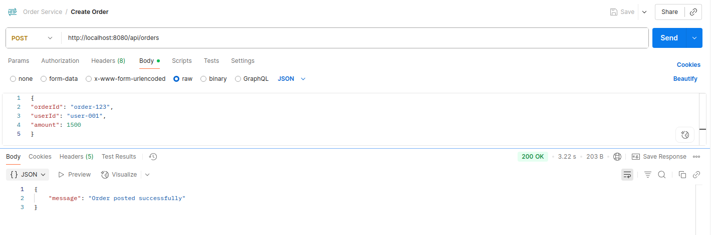
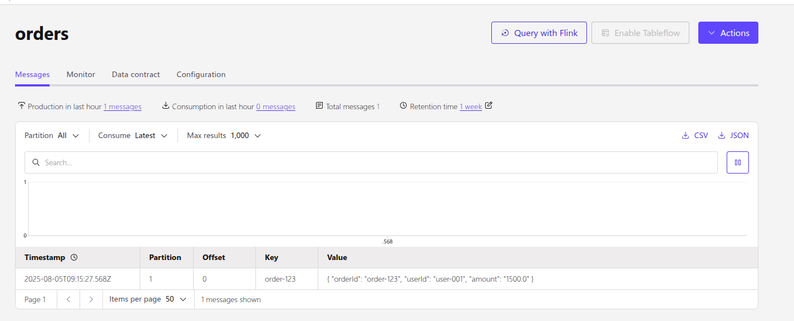
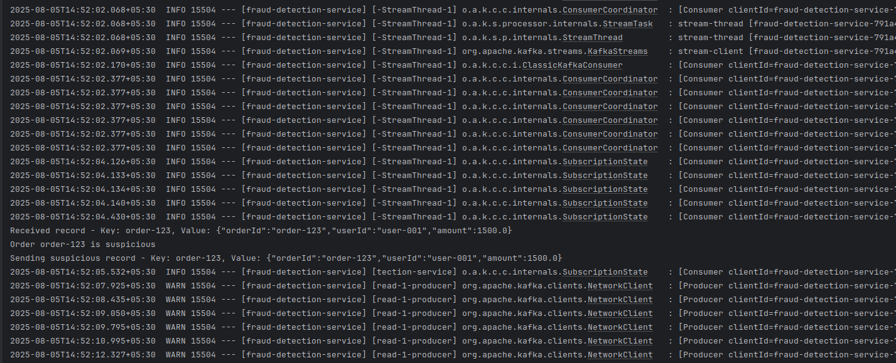
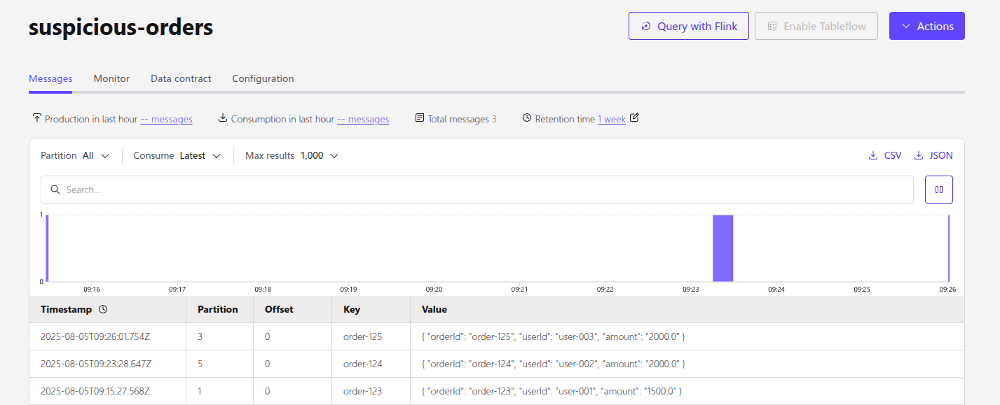

# kafka-streams-with-spring-boot-and-confluent-cloud

This project demonstrates a **microservices architecture using Spring Boot and Apache Kafka (Confluent)**. It showcases **real-time order processing** and **fraud detection using Kafka Streams**, making it an ideal reference for anyone learning **Kafka Stream with Spring Boot**.

---

# Microservices Overview

## 1. 🛒 Order Service (Spring Boot + Kafka Producer)

- **Purpose**: Accepts order requests via REST API.
- **Endpoint**: `POST /api/orders`
- **Functionality**: Publishes order data to a Kafka topic named `orders`.

## 2. 🔍 Fraud Detection Service (Spring Boot + Kafka Streams)

- **Purpose**: Monitors the `orders` topic for high-value transactions.
- **Logic**:
    - Orders with `amount > 1000` are considered suspicious.
    - Suspicious orders are forwarded to the Kafka topic `suspicious-orders`.

This service uses **Kafka Streams** for real-time stream processing.

---

# 🔗 Kafka Topics on Confluent Platform

| Topic               | Description                                   |
|--------------------|-----------------------------------------------|
| `orders`           | Raw orders from Order Service (Kafka Producer) |
| `suspicious-orders`| Filtered orders flagged as suspicious         |

---

# ⚙️ Technology Stack

- **Java**
- **Spring Boot**
- **Apache Kafka**
- **Kafka Streams API**
- **Confluent Kafka (Cloud)**
- **Maven**

---

# ✅ Prerequisites

- Java 17+
- Maven

---

# ⚙️ Set Up the Kafka Properties

## 1. Get the Bootstrap Server
- Go to your cluster on Confluent Cloud
- Navigate to Cluster Settings → Endpoints
- Copy the Bootstrap Server URL
- Set it in your application.properties:
  ```bash
  spring.kafka.bootstrap-servers=your-cluster-endpoint
  ```

## 2. Generate API Key & Secret
- If you don’t already have one, go to API Keys in Confluent Cloud
- Create a new API key scoped to your cluster

## 3. Add Credentials to application.properties
- Replace API_KEY and SECRET below with your actual values:
  ```bash
  spring.kafka.properties.sasl.jaas.config=org.apache.kafka.common.security.plain.PlainLoginModule required username='API_KEY' password='SECRET';
  ```

---

# 🧪 Testing the Microservices

Once both services and Confluent Cloud are running, you can test the full flow using Postman or cURL.

## ✅ Step 1: Create an Order (Order Service)
Send a POST request to the Order Service to publish an order to Kafka:
- Endpoint: POST http://localhost:8080/api/orders
- Sample Payload (JSON)
```bash
{
"orderId": "order-123",
"userId": "user-001",
"amount": 1500
}
```
- The API Response:
  
- This request will create a Kafka topic `orders` and produce a message to it.
  

---

## 🔍 Step 2: Verify Suspicious Orders

- The Fraud Detection Service (Kafka Streams) will:
  - Read from orders
  - Detect if it's suspicious
  - Publish to suspicious-orders topic
- Log Output (Fraud Detection Service):
  
- Confluent Cloud UI:
  - Go to your cluster → suspicious-orders topic
  - Click on Messages to view output
  
  


